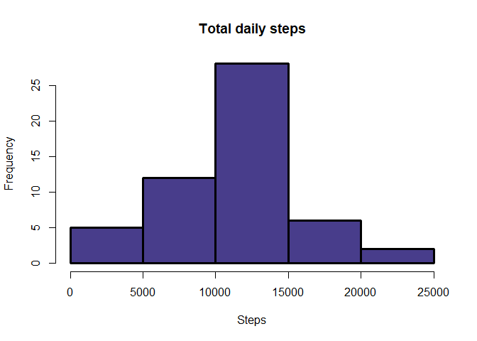
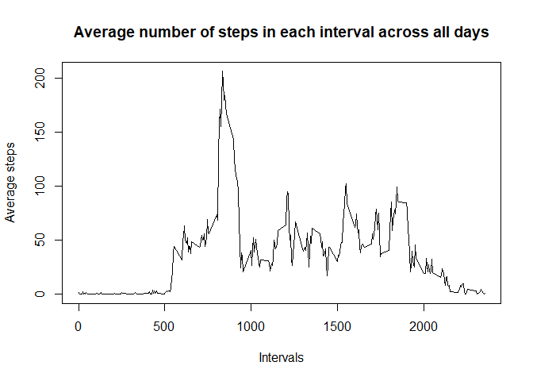
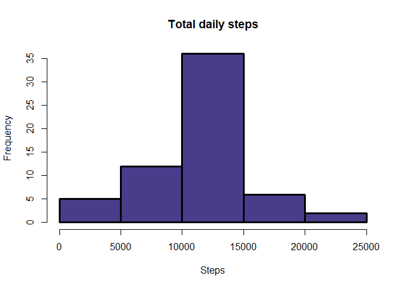
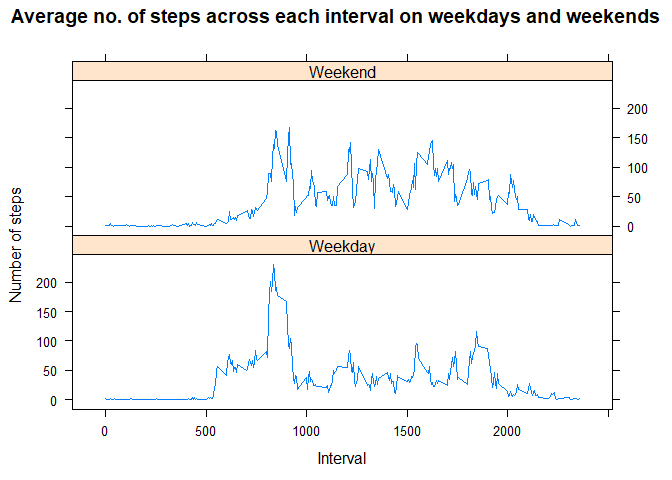

## Loading the necessary libraries for analysis


```r
library(dplyr)
```

```
## 
## Attaching package: 'dplyr'
```

```
## The following objects are masked from 'package:stats':
## 
##     filter, lag
```

```
## The following objects are masked from 'package:base':
## 
##     intersect, setdiff, setequal, union
```

```r
library(chron)
```

```
## NOTE: The default cutoff when expanding a 2-digit year
## to a 4-digit year will change from 30 to 69 by Aug 2020
## (as for Date and POSIXct in base R.)
```

```r
library(lattice)
```


## Loading and preprocessing the data


```r
data  = read.csv("activity.csv")
data$date = as.Date(data$date,format = "%Y-%m-%d")
```


## What is mean total number of steps taken per day?

#### 1. *Histogram of the total number of steps taken each day*

```r
# Here, missing values are ignored

totalsteps = filter(data , !is.na(steps)) %>% aggregate(steps ~ date , data=.,FUN = sum)
par(lwd = 3)
hist(totalsteps$steps , col = "darkslateblue" , main = "Total daily steps" , xlab = "Steps")
```

<!-- -->

#### 2. *Mean and median of the total number of steps taken per day*


```r
summary(totalsteps$steps)
```

```
##    Min. 1st Qu.  Median    Mean 3rd Qu.    Max. 
##      41    8841   10765   10766   13294   21194
```


## What is the average daily activity pattern?

#### 1. *Time series plot of the average number of steps taken*


```r
avgsteps = filter(data , !is.na(steps)) %>% group_by(interval)  %>% summarise(avg.steps = mean(steps))
```

```
## `summarise()` ungrouping output (override with `.groups` argument)
```

```r
plot(avgsteps$interval,avgsteps$avg.steps,type = "l", xlab = "Intervals", ylab = "Average steps" , main = "Average number of steps in each interval across all days")
```

<!-- -->

#### 2. *The 5-minute interval that, on average, contains the maximum number of steps*


```r
filter(avgsteps , avg.steps == max(avgsteps$avg.steps))
```

```
## # A tibble: 1 x 2
##   interval avg.steps
##      <int>     <dbl>
## 1      835      206.
```


## Imputing missing values

#### 1. *Total number of missing values in the dataset * 


```r
sum(!complete.cases(data))
```

```
## [1] 2304
```


#### 2. *Code to describe and show a strategy for imputing missing data*

*Missing values for "steps" are filled in with the average value of "steps" for that 5-minute interval , as shown below* 

```r
imputed.data = data %>% group_by(interval)  %>% mutate(steps=ifelse(is.na(steps),mean(steps,na.rm=TRUE),steps))
```

#### 3. *Histogram of the total number of steps taken each day after missing values are imputed*


```r
totalsteps.imputed = aggregate(steps ~ date , data = imputed.data , FUN = sum)
par(lwd = 3)
hist(totalsteps.imputed$steps , col = "darkslateblue" , main = "Total daily steps" , xlab = "Steps")
```

<!-- -->


## Are there differences in activity patterns between weekdays and weekends?

#### *Panel plot comparing the average number of steps taken per 5-minute interval across weekdays and weekends*


```r
week.data = mutate(imputed.data , day_type = ifelse(is.weekend(date) , "Weekend","Weekday")) 
week.data =  aggregate(steps ~ interval + day_type , data = week.data, FUN = mean)

xyplot(steps~interval|day_type , week.data , type="l" , layout = c(1,2) , xlab = "Interval" , ylab = "Number of steps" , main = "Average no. of steps across each interval on weekdays and weekends")
```

<!-- -->
